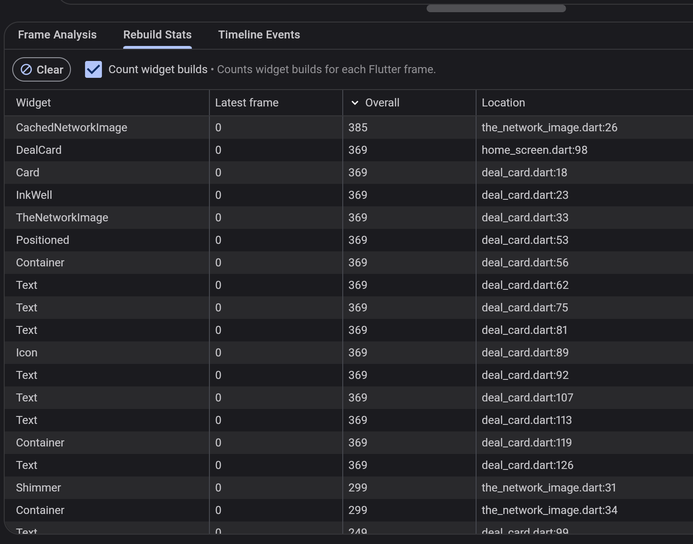
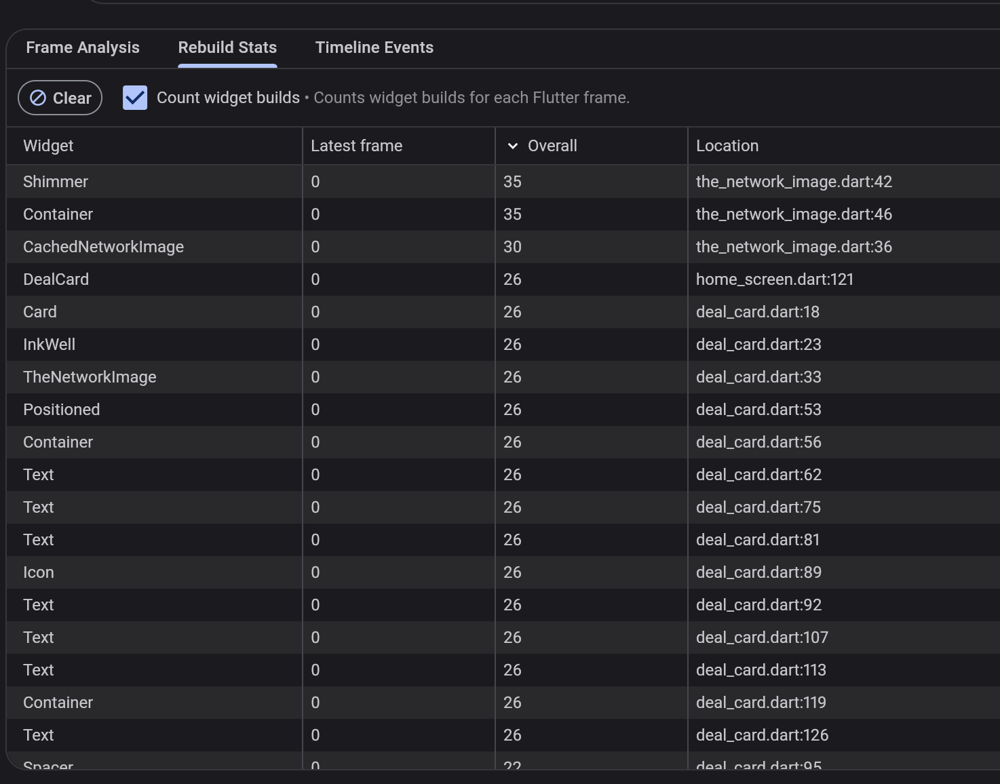
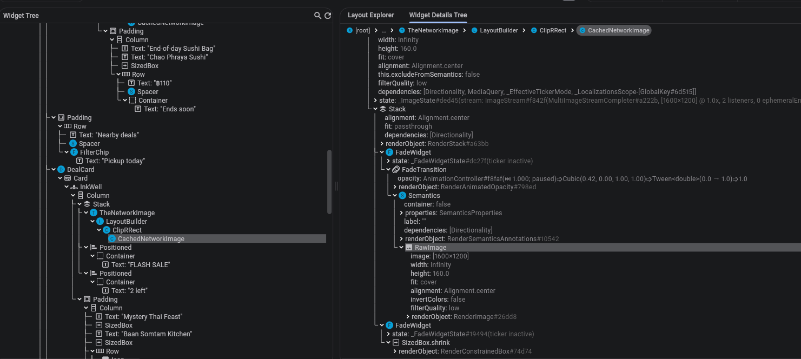
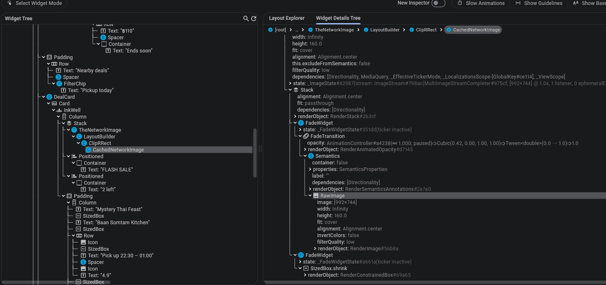

# Assessment solutions

## RES-101 — Search shows results for the wrong query

**Reproduction:** Typing `sushi` letter by letter caused shorter-query results
to replace the results for the full keyword.

**Root cause:** Search requests completed out of order, and every response
could overwrite the results and loading state without checking whether its
query was still current. The simulated backend gives shorter queries longer
delays, making this race easy to trigger.

**Fix:** Increment a version immediately on every query change. Only the
current version may update results, report errors, or clear loading. A 300 ms
debouncer reduces requests while typing; the version checks prevent stale
responses from affecting the current search.

**Alternative considered:** During review, considered debouncing alone. It
reduces requests but cannot prevent an already-running request from returning
outdated results, so version checks are also needed.

**Edge cases and limits:** Clearing input, including whitespace-only input,
resets the state and cancels the debounce. Closing the controller cancels the
timer and invalidates pending work. Older responses are ignored even during
the next debounce interval. In-flight API calls finish rather than being
cancelled. Current-query errors retain the existing console logging.

**Verification:** Focused Dart analysis of the search controller and debounce
utility passed.

## RES-102 — Crash after leaving My orders

**Root cause:** `PickupCountdown.initState()` started a periodic timer that
called `setState()` every second without storing or cancelling the timer.
After leaving My orders, the widget state was disposed, but the timer kept
running and called `setState()` on that disposed state.

**Fix:** Store the timer in a `late final Timer` field and call
`_timer.cancel()` in the widget state's `dispose()`, before `super.dispose()`.
This stops callbacks and releases the timer's reference to the state.

**Alternative considered:** A `mounted` check alone would avoid the invalid
`setState()` call but leave the periodic timer and its reference to the state
alive. Cancelling the timer addresses the underlying resource leak.

**Edge cases and limits:** Cleanup also applies when leaving before the first
tick or repeatedly opening and closing the screen. While the widget remains
mounted, the timer still ticks after pickup opens; that behavior is unchanged.

**Verification:** Reviewed the implementation and ran focused Dart analysis:
no issues found.

## RES-103 — Requests pile up the longer you browse

**Reproduction:** cart changes trigger
availability requests for previously visited deal pages.

**Root cause:** Each `DealDetailsController` created an `ever` subscription to
the permanent cart service's `itemCount`, but discarded the returned `Worker`.
The subscription survived controller closure, retained the controller through
its callback, and kept fetching that controller's deal on cart changes.

**Fix:** Keep the returned worker in `_cartWorker` and dispose it in the
controller's `onClose()`. This ends the subscription when its owner closes.

**Alternative considered:** An `isClosed` guard alone can suppress requests
but leaves the subscription and retained controller alive.

**Edge case:** Disposing the worker does not cancel an already-running API
request. The `isClosed` check is before `await`, which prevents
starting work on a closed controller. A second check after `await` is to prevent updating state if the controller closes during the fetch.

**Verification:** Reviewed the worker cleanup and ran focused Dart analysis:
no issues found.

## RES-104 — Duplicate deals in the home feed

**Reproduction setup:** Added a temporary delay to pagination to make it
easier to refresh while a page request was pending; removed it from the fix.

**Root cause:** Refresh reset `_page` to 1 while an older pagination request
could still append its results. The list and page number became inconsistent,
so a later load requested and appended the same page again.

**Fix:** `_isRefreshing` blocks load-more while refresh is pending. Refresh
can still interrupt pagination: it increments `_feedVersion`, and
`_isCurrentFeed` rejects obsolete responses and cleanup. Each load uses a
local `nextPage`, updating `_page` only after an accepted successful response.

**Alternative considered:** Rejected Codex's extra request counter and custom
footer-state handling as unnecessarily complicated and hard to maintain.

**Edge cases and limits:** Version checks also guard errors and `finally`,
so old requests cannot clear newer loading flags. Failed refreshes preserve
the existing feed and page; failed pagination can retry the same page.
Successful refresh resets the end-of-list footer. Pending requests finish,
but obsolete responses or responses after controller closure are ignored.

**Verification:** Reviewed the implementation and ran focused Dart analysis:
no issues found.

## RES-105 — Home feed performance and image memory

**Root cause:** The outer `Obx` observed every scroll-offset change and rebuilt
the whole home scaffold. The eager children list also recreated `DealCard`
widgets for every loaded deal. Separately, images decoded at the API's full
1600×1200 resolution even when displayed in smaller cards.

**Fix:** Replace the reactive offset with two threshold flags (`offset > 4`
and `offset > 800`), observed separately by the app bar and scroll-to-top
button. Use `ListView.builder` to create feed cards on demand. Read feed and
filter state inside the body's `Obx`, before its deferred item builder runs.
Use `LayoutBuilder` and device pixel ratio to set `memCacheWidth` from the
image's displayed width, preserving its source aspect ratio.

**Alternative considered:** `ListView.builder` alone would reduce widget
construction but leave the scroll-triggered rebuilds and full-size image
decoding. All three changes address separate costs.

**Edge cases and limits:** Empty feeds and absent flash deals retain the
header/filter. Refresh, pagination, and filtering still update the body.
Unbounded or non-positive image widths fall back to the original decode size.
Sizing uses width; sharpness for height-driven cover crops needs separate
verification.

**Before/after evidence:** DevTools Rebuild Stats captures show the following
`Overall` build counts. Inspector captures show the same "Mystery Thai Feast"
feed card's `RawImage.image` dimensions.

| Measurement | Before | After |
| --- | ---: | ---: | 
| `DealCard` builds | 369 | 26 |
| `TheNetworkImage` builds at the feed-card call site | 369 | 26 |
| `CachedNetworkImage` builds | 385 | 30 |
| `Shimmer` builds | 299 | 35 |
| Decoded image dimensions | 1600×1200 | 992×744 |
| Displayed image height (logical pixels) | 160 | 160 |
| Estimated pixel-buffer memory for this image | 7.32 MiB | 2.82 MiB |

Pixel-buffer estimates use `width × height × 4 / 1,048,576`: approximately
**61.6% less per image** in this comparison. Build totals depend on the capture
duration and scrolling; they are not a normalized frame-time benchmark.
These results do not claim an equivalent reduction in total app memory.

| Rebuilds — before | Rebuilds — after |
| --- | --- |
|  |  |

| Image decoding — before | Image decoding — after |
| --- | --- |
|  |  |

**Verification:** Reviewed and approved the implementation, captured the
DevTools evidence above, and ran focused Dart analysis with no issues found.

## AI usage log

- **Codex — preparation:** Explained the assessment requirements, project
  architecture, and data flow from the local brief and source code.
- **Codex — RES-101:** Suggested the reproduction procedure, reviewed the
  existing implementation, ran
  focused Dart analysis, and helped document the diagnosis and decisions.
- **Codex — RES-102:** Traced order loading and countdown creation, identified
  the uncancelled timer, suggested cancelling it in `dispose()`, reviewed the
  implemented fix, and ran focused Dart analysis.
- **Codex — RES-103:** Reviewed the applicant's diagnosis, traced the worker
  subscription in application and GetX source, and explained controller-owned
  cleanup. Reviewed the implemented fix, ran focused Dart analysis.
- **Codex — RES-104:** Traced refresh and pagination, explained how a stale
  page response corrupts page state, and implemented an initial fix that I
  rejected as too complicated to maintain. Reviewed my simpler replacement
  and ran focused Dart analysis.
- **Codex — RES-105:** Traced generated image URLs into the image widget,
  explained rebuild and decoded-image costs, and implemented scoped scroll
  reactivity, lazy feed cards, and image decode sizing. I reviewed and approved
  the changes and simplified the sizing to use display width. Codex checked
  the code with Dart analysis and helped summarize my DevTools screenshots.

**Incorrect or misleading suggestions:**

1. **RES-104 — Overcomplicated implementation:** Codex added a separate load
   request counter and custom deferred footer-state handling alongside feed
   versioning. On review, I found the added complexity made a focused race
   condition fix harder to understand and maintain. I discarded the changes
   and implemented a simpler solution using a refresh flag, feed version,
   and the existing refresh-controller methods.

## Design questions

### Q1 — GetX controller lifecycle versus widget State lifecycle

Pending: explain the distinction and identify a relevant Part A bug.

### Q2 — Scoping Obx reactivity

Pending: explain when a large reactive subtree hurts performance and how to
choose the appropriate scope.

### Q3 — Automated coverage for RES-106

Pending: describe a test that would catch the pickup-time bug and any code
changes needed to make it testable.

## Time spent and next steps

- **RES-101:** About 15 minutes elapsed on 2026-09-23;
- **RES-102:** About 5 minutes.
- **RES-103:** About 10 minutes for inspection and the solution.
- **RES-104:** About 25 minutes for inspection and the solution.
- **RES-105:** About 30 minutes of active work.
- **Remaining work:** RES-106 and RES-107, features, and design answers.
- **With one more day:** Pending; decide based on the completed work.
