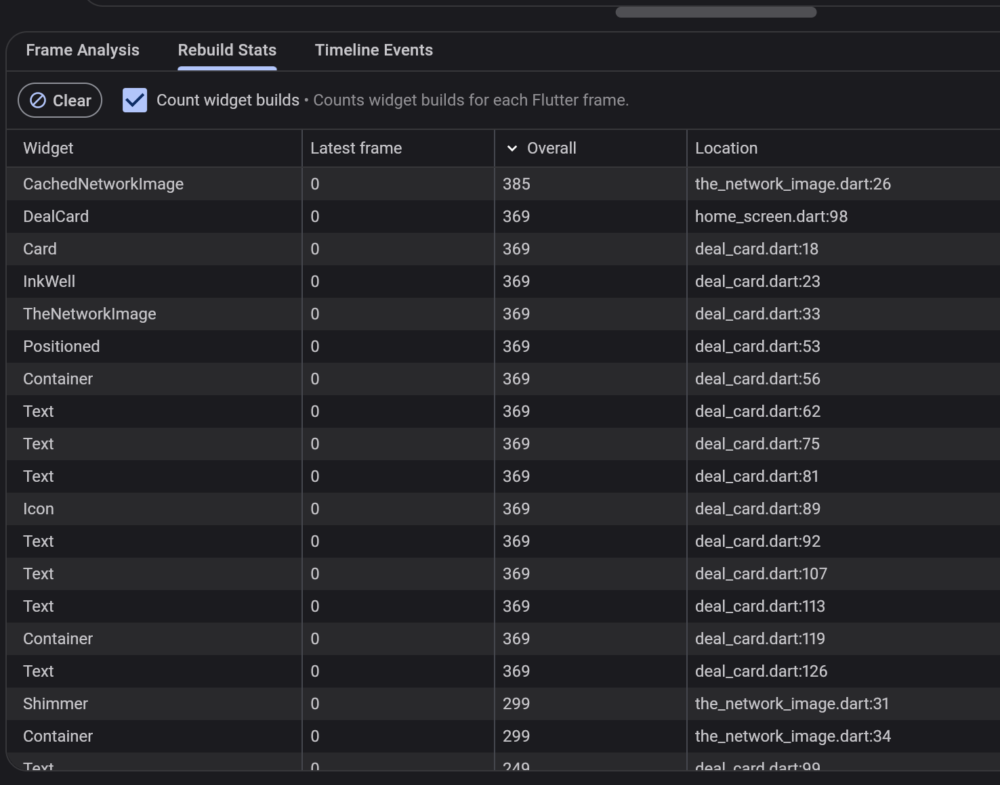
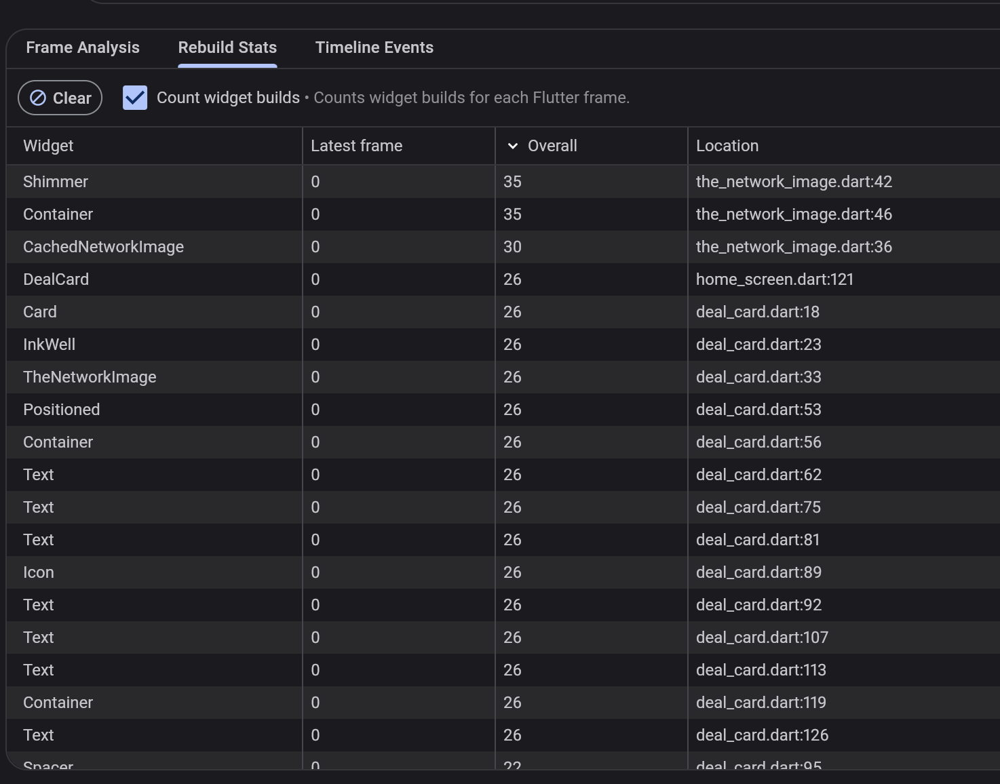
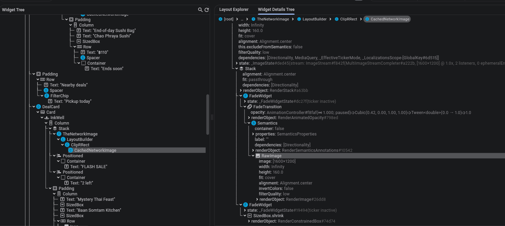
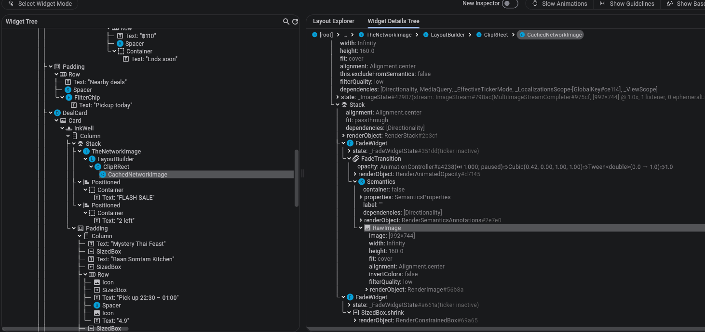
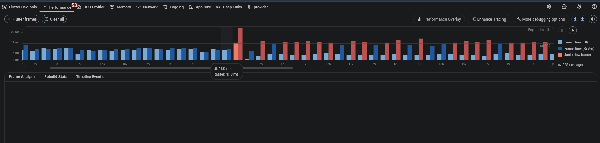
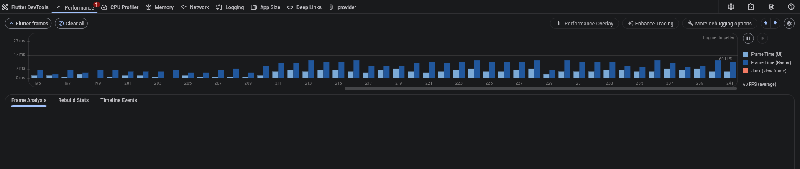
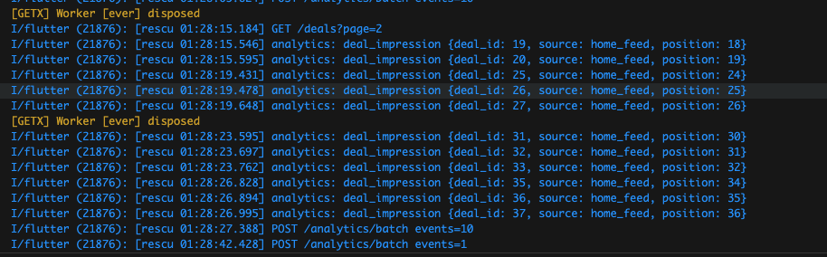
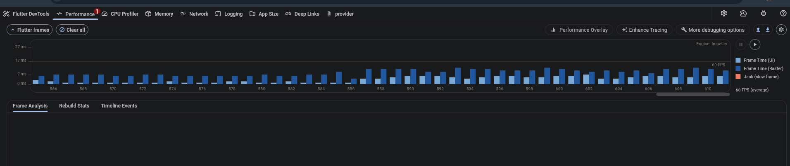

# Assessment solutions

## RES-101 — Search shows results for the wrong query

**Reproduction:** Typing `sushi` letter by letter caused shorter-query results
to replace the results for the full keyword.

**Root cause:** Search requests completed out of order, and every response
could overwrite the results and loading state without checking whether its
query was still current. The simulated backend gives shorter queries longer
delays, making this race easy to trigger.

**Fix:** Increment a version immediately on every query change. Only the
current version may update results, report errors, or clear loading. A 300 ms
debouncer reduces requests while typing; the version checks prevent stale
responses from affecting the current search.

**Alternative considered:** During review, considered debouncing alone. It
reduces requests but cannot prevent an already-running request from returning
outdated results, so version checks are also needed.

**Edge cases and limits:** Clearing input, including whitespace-only input,
resets the state and cancels the debounce. Closing the controller cancels the
timer and invalidates pending work. Older responses are ignored even during
the next debounce interval. In-flight API calls finish rather than being
cancelled. Current-query errors retain the existing console logging.

**Verification:** Focused Dart analysis of the search controller and debounce
utility passed.

## RES-102 — Crash after leaving My orders

**Root cause:** `PickupCountdown.initState()` started a periodic timer that
called `setState()` every second without storing or cancelling the timer.
After leaving My orders, the widget state was disposed, but the timer kept
running and called `setState()` on that disposed state.

**Fix:** Store the timer in a `late final Timer` field and call
`_timer.cancel()` in the widget state's `dispose()`, before `super.dispose()`.
This stops callbacks and releases the timer's reference to the state.

**Alternative considered:** A `mounted` check alone would avoid the invalid
`setState()` call but leave the periodic timer and its reference to the state
alive. Cancelling the timer addresses the underlying resource leak.

**Edge cases and limits:** Cleanup also applies when leaving before the first
tick or repeatedly opening and closing the screen. While the widget remains
mounted, the timer still ticks after pickup opens; that behavior is unchanged.

**Verification:** Reviewed the implementation and ran focused Dart analysis:
no issues found.

## RES-103 — Requests pile up the longer you browse

**Reproduction:** cart changes trigger
availability requests for previously visited deal pages.

**Root cause:** Each `DealDetailsController` created an `ever` subscription to
the permanent cart service's `itemCount`, but discarded the returned `Worker`.
The subscription survived controller closure, retained the controller through
its callback, and kept fetching that controller's deal on cart changes.

**Fix:** Keep the returned worker in `_cartWorker` and dispose it in the
controller's `onClose()`. This ends the subscription when its owner closes.

**Alternative considered:** An `isClosed` guard alone can suppress requests
but leaves the subscription and retained controller alive.

**Edge case:** Disposing the worker does not cancel an already-running API
request. The `isClosed` check is before `await`, which prevents
starting work on a closed controller. A second check after `await` is to prevent updating state if the controller closes during the fetch.

**Verification:** Reviewed the worker cleanup and ran focused Dart analysis:
no issues found.

## RES-104 — Duplicate deals in the home feed

**Reproduction setup:** Added a temporary delay to pagination to make it
easier to refresh while a page request was pending; removed it from the fix.

**Root cause:** Refresh reset `_page` to 1 while an older pagination request
could still append its results. The list and page number became inconsistent,
so a later load requested and appended the same page again.

**Fix:** `_isRefreshing` blocks load-more while refresh is pending. Refresh
can still interrupt pagination: it increments `_feedVersion`, and
`_isCurrentFeed` rejects obsolete responses and cleanup. Each load uses a
local `nextPage`, updating `_page` only after an accepted successful response.

**Alternative considered:** Rejected Codex's extra request counter and custom
footer-state handling as unnecessarily complicated and hard to maintain.

**Edge cases and limits:** Version checks also guard errors and `finally`,
so old requests cannot clear newer loading flags. Failed refreshes preserve
the existing feed and page; failed pagination can retry the same page.
Successful refresh resets the end-of-list footer. Pending requests finish,
but obsolete responses or responses after controller closure are ignored.

**Verification:** Reviewed the implementation and ran focused Dart analysis:
no issues found.

## RES-105 — Home feed performance and image memory

**Root cause:** The outer `Obx` observed every scroll-offset change and rebuilt
the whole home scaffold. The eager children list also recreated `DealCard`
widgets for every loaded deal. Separately, images decoded at the API's full
1600×1200 resolution even when displayed in smaller cards.

**Fix:** Replace the reactive offset with two threshold flags (`offset > 4`
and `offset > 800`), observed separately by the app bar and scroll-to-top
button. Use `ListView.builder` to create feed cards on demand. Read feed and
filter state inside the body's `Obx`, before its deferred item builder runs.
Use `LayoutBuilder` and device pixel ratio to set `memCacheWidth` from the
image's displayed width, preserving its source aspect ratio.

**Alternative considered:** `ListView.builder` alone would reduce widget
construction but leave the scroll-triggered rebuilds and full-size image
decoding. All three changes address separate costs.

**Edge cases and limits:** Empty feeds and absent flash deals retain the
header/filter. Refresh, pagination, and filtering still update the body.
Unbounded or non-positive image widths fall back to the original decode size.
Sizing uses width; sharpness for height-driven cover crops needs separate
verification.

**Before/after evidence:** DevTools Rebuild Stats captures show the following
`Overall` build counts. Inspector captures show the same "Mystery Thai Feast"
feed card's `RawImage.image` dimensions.

| Measurement                                         |    Before |    After |
| --------------------------------------------------- | --------: | -------: |
| `DealCard` builds                                   |       369 |       26 |
| `TheNetworkImage` builds at the feed-card call site |       369 |       26 |
| `CachedNetworkImage` builds                         |       385 |       30 |
| `Shimmer` builds                                    |       299 |       35 |
| Decoded image dimensions                            | 1600×1200 |  992×744 |
| Displayed image height (logical pixels)             |       160 |      160 |
| Estimated pixel-buffer memory for this image        |  7.32 MiB | 2.82 MiB |

Pixel-buffer estimates use `width × height × 4 / 1,048,576`: approximately
**61.6% less per image** in this comparison. Build totals depend on the capture
duration and scrolling; they are not a normalized frame-time benchmark.
These results do not claim an equivalent reduction in total app memory.

| Rebuilds — before                                                         | Rebuilds — after                                                       |
| ------------------------------------------------------------------------- | ---------------------------------------------------------------------- |
|  |  |

| Image decoding — before                                                              | Image decoding — after                                                           |
| ------------------------------------------------------------------------------------ | -------------------------------------------------------------------------------- |
|  |  |

**Verification:** Reviewed and approved the implementation, captured the
DevTools evidence above, and ran focused Dart analysis with no issues found.

## RES-106 — Pickup times and the today filter

**Root cause:** `PickupWindowModel.label` formatted parsed UTC timestamps without
converting them to the pickup timezone. `isToday` compared the UTC start's
day number with the device-local current day and ignored month and year.
The backend serves the Bangkok market (UTC+7); device-local and market time
are not necessarily the same.

**Reproduction:** Ran the existing model in a temporary Dart probe with
`TZ=Asia/Bangkok`. A window starting today at 06:00 and ending at 09:30
displayed `23:00 – 02:30`, and `isToday` returned false. A noon window on the
same day number next year incorrectly returned true.

**Fix:** Keep the original UTC instants and derive Bangkok
calendar values only for labels and date checks. Compare year, month, and day.
`isToday` delegates to `isTodayAt(now)` so tests can supply a fixed clock.
Countdown and availability calculations continue to use the original instants.

**Alternative considered:** `toLocal()` alone would use the phone's timezone,
which may differ from the store's Bangkok timezone.

**Edge cases and limits:** Covers midnight, month/year boundaries, and local
or UTC inputs. Overnight windows are classified by their start date. The fixed
UTC+7 conversion is specific to this Bangkok market; other store timezones and
automatic screen updates at midnight are outside this change.

**Verification:** Reviewed and approved the implementation. Focused Dart
analysis passed.

## RES-107 — Deep link opens to a crash

**Root cause:** `DealDetailsController.onInit()` cast
`Get.arguments` directly to `DealModel`. Feed taps supply that object, but
deep links supply an ID in the URL parameters without navigation arguments.
The null cast failed before details initialization. The screen also read the
`late final deal` immediately, so asynchronous loading needed a guarded UI.

**Fix:** Use a supplied deal unless it conflicts with the URL ID;
otherwise load through `DealRepo.fetchById`. Capture the ID and analytics
source before awaiting. A nullable reactive deal replaces the `late final`
field, and the screen shows loading or a retryable error before displaying
the normal details and Add to bag button. Initialize availability, analytics,
and the cart worker only after obtaining the deal.

**Alternative considered:** Catching the null cast and showing a fallback
would hide the crash without loading the requested deal, failing the ticket.

**Edge cases:** Missing/non-numeric/non-positive IDs show an invalid-link
message; missing deals and fetch failures show errors. Overlapping retries
are ignored, and successful loads cannot register duplicate cart workers.
Closure guards ignore late responses and preserve worker disposal from
RES-103. Deal 42 exists in the catalog.

**Verification:** Reviewed and approved the implementation. Focused Dart
analysis passed.

## F-1 — Live flash-sale countdowns

**Implementation:** A shared clock drives countdown text in the flash rail,
feed/search cards, and details. A separate expiry builder updates cards and
the purchase button only when their expired state changes. Expired cards stay
visible, labelled `Expired`, and disabled. The cart checks the actual deadline when
adding/increasing quantity and removes expired lines with a visible notice,
independently of mounted screens.

**Alternative considered:** Widget-owned expiry callbacks would miss bag
cleanup when a card is off-screen. The app-wide cart owns that rule, while
one shared timer avoids a separate timer for every countdown.

**Edge cases and decisions:** Ordinary deals have no flash expiry. Positive
fractions of a second round up; zero/past deadlines show `Expired`. Resume
refreshes the clock immediately. Checkout removes expired lines and stops
for review if the bag changes. An order submitted while valid honors the
backend response even if its flash sale expires while awaiting that response.
Timers and workers are cleaned up by their owners.

**Initial verification:** Reviewed and approved the implementation. Focused Dart
analysis passed. A temporary Dart probe passed 21 formatting/model checks,
including exact expiry and timezone-equivalent instants. DevTools profiling
with 100+ countdowns has not yet been confirmed.

**Performance correction:** Applying `Opacity(0.5)` to whole expired cards
added offscreen compositing work and recurring raster jank. This rendering
cost can occur without rebuilding the whole card. Removed that opacity from
the shared feed/search cards and flash rail. These cards also replace the
countdown with plain `Text('Expired')` at expiry, disposing the countdown's
reactive subscription. Expired labels and disabled taps remain; the cards
are no longer dimmed.

**Manual verification:** Profile mode on a physical Pixel 6a, using Impeller.

1. Observed the home screen before and after expiry. With whole-card opacity
   set to 0.5 after expiry, recurring slow raster frames appeared.
2. Forced opacity to 0.5 from the start: jank appeared before expiry too,
   isolating opacity as the cause rather than the `Expired` text itself.
3. Removed the opacity widgets and observed the home screen after expiry
   again. Captured the before/after results below.

| Screenshot metric                       | Before: expired cards at 0.5 opacity | After: opacity removed |
| --------------------------------------- | ------------------------------------ | ---------------------- |
| Displayed average FPS                   | 57                                   | 60                     |
| Slow frames in the visible chart window | Repeated red bars                    | No red bars            |

These captures show improvement in the observed windows; they do not establish
zero jank throughout the full session or replace the 100+ countdown stress check.

Before:

After:

## F-2 — Impression tracking

**Implementation:** A shared card wrapper starts a one-second timer at 50%
visibility and cancels it below that threshold, on route/background changes,
or disposal. Visibility callbacks run after each frame and do not rebuild
cards. The session-wide analytics service accepts only the first impression
per deal ID, with its source and zero-based list position (excluding the home
header). It batches impressions at 10 events or 15 seconds from the first
waiting event; existing screen/detail events remain local debug history.

**Alternative considered:** Logging from `build()` would count off-screen
cards and rebuilds. A per-card deduplication flag would reset when cards are
recreated and allow duplicates across screens. A sliding batch timer would
postpone delivery whenever another event arrived.

**Edge cases and limits:** Visibility interruptions reset the full second;
changes that stay above 50% do not restart it. First qualification determines
source/position. Detector keys are unique per card instance. Only the current
route and active app count; arbitrary overlapping widgets remain a detector
limitation. Failed batches remain queued for retry, new arrivals survive an
in-flight send, and requests do not overlap. Session state and pending events
are in memory and do not survive process termination.

**Verification:** Reviewed and approved the implementation. Focused Dart
analysis passed during implementation and after merging with the F-1 expiry
fix. Manual batching and performance evidence are below. Flutter test
execution has not been confirmed.

**Manual batching check (2026-09-28):** Scrolled the home feed to generate
11 `deal_impression` events, then waited for the remaining event to flush.
The logs include `deal_id`, `source: home_feed`, and zero-based `position`.

| Logged time               | Result                              |
| ------------------------- | ----------------------------------- |
| 01:28:15.546–01:28:26.995 | 11 distinct deal impressions logged |
| 01:28:27.383              | `POST /analytics/batch events=10`   |
| 01:28:42.428              | `POST /analytics/batch events=1`    |

The two batch logs are 15.045 seconds apart. This confirms the 10-event
flush and the timed flush of the remaining event in this run. The fake API
logs after its simulated latency, so log timestamps include that delay.

**Before/after performance check (2026-09-28):** Compared F-1 (before impression tracking) with F-2 on the same physical
Pixel 6a in profile mode. Both screenshots show the Impeller renderer.

Performance test procedure:

1. Open the home feed and observe DevTools Performance.
2. Scroll to the end of five pages.
3. Return to the top and leave the app untouched for 10 seconds.
4. Capture the displayed frame chart for comparison.

| Measurement shown in DevTools           | Before F-2 (corrected F-1) | After F-2 |
| --------------------------------------- | -------------------------: | --------: |
| Displayed average FPS                   |                         60 |        60 |
| Target FPS                              |                         60 |        60 |
| Renderer                                |                   Impeller |  Impeller |
| Slow frames in the visible chart window |                       None |      None |

**Observation:** Both captures report 60 FPS on average. The visible UI/raster
bars stay below the approximately 16.7 ms frame-budget line in both windows,
with no red slow-frame bars. No obvious regression is visible in this spot check.

**Evidence limits:** These are one before/after screenshot pair showing a
limited frame window from each run, not complete scrolling traces.
They do not establish full-run slow-frame percentages, p95 frame times, or
repeatability across multiple runs.

**Before F-2 — F-1 after the raster fix:**

**After F-2 — impression tracking enabled:**

## F-3 — Stock reservations

**Implementation:** The app-wide cart owns reservations and checkout. Adding
or changing quantity updates the bag immediately with a pending state, then
reserves through `OrderRepo`. Failed initial reservations or quantity
replacements remove the unreserved line with a friendly notice. The user can
explicitly try adding it again. Pending lines cannot change quantity or enter checkout.
Each confirmed line shows its backend deadline using the shared clock; only
the countdown text rebuilds each second. Removal and F-1 expiry release holds.

**Quantity changes and alternative considered:** The API cannot resize a
hold. Release the old reservation, then reserve the full new quantity. A
replacement has a new five-minute deadline. If replacement fails, remove the
line with a notice because its old hold has already been released. Never reuse
the released ID. Automatic recovery to the previous quantity was considered
and rejected: it adds another request and more failure states, and can restore
a quantity the user no longer wants. Keep retries explicit.

**Expiry decision:** Remove expired reservations with a visible notice and
let the user add the deal again if available. Do not automatically renew
holds. Expiry is checked on clock ticks, resume, and before checkout. If
validation removes anything, stop checkout so the user can review the bag.
This avoids silently purchasing a changed selection or holding stock
indefinitely without another user action.

**Mid-checkout decision:** Lock bag edits and retain the submitted items for
the request. Expiry can remove lines locally, but their holds are released
only after the backend responds. Honor success even if the local deadline
passed while waiting. A `410` removes expired holds; if no local expiry
explains it, invalidate all submitted holds because the API does not identify
the unknown reservation. Show a clear message and require an explicit retry.
Other failures keep still-valid items. Never automatically resubmit checkout.

**Edge cases and limits:** One reservation operation per line; removed and
re-added deals use different item instances, so late successes are released
instead of restoring an obsolete item. Pending requests also check flash-sale
expiry after completion. Checkout survives screen disposal. Bag state is not
persisted across app restarts; failed release cleanup is logged and the
backend's five-minute deadline remains the fallback.

**Verification:** Focused Dart analysis passed. All tests passed, covering optimistic rollback, quantity replacement, removal on failed increases and decreases without automatic retry, late responses,
flash/reservation expiry, checkout payloads and locking, success after expiry,
`410` reconciliation, and retry after other failures. Initial failures came
from queued snackbar timers in test cleanup; closing notices individually
fixed cleanup without changing the reservation logic or assertions.

## AI usage log

- **Codex — preparation:** Explained the assessment requirements, project
  architecture, and data flow from the local brief and source code.
- **Codex — RES-101:** Suggested the reproduction procedure, reviewed the
  existing implementation, ran
  focused Dart analysis, and helped document the diagnosis and decisions.
- **Codex — RES-102:** Traced order loading and countdown creation, identified
  the uncancelled timer, suggested cancelling it in `dispose()`, reviewed the
  implemented fix, and ran focused Dart analysis.
- **Codex — RES-103:** Reviewed the applicant's diagnosis, traced the worker
  subscription in application and GetX source, and explained controller-owned
  cleanup. Reviewed the implemented fix, ran focused Dart analysis.
- **Codex — RES-104:** Traced refresh and pagination, explained how a stale
  page response corrupts page state, and implemented an initial fix that I
  rejected as too complicated to maintain. Reviewed my simpler replacement
  and ran focused Dart analysis.
- **Codex — RES-105:** Traced generated image URLs into the image widget,
  explained rebuild and decoded-image costs, and implemented scoped scroll
  reactivity, lazy feed cards, and image decode sizing. I reviewed and approved
  the changes and simplified the sizing to use display width. Codex checked
  the code with Dart analysis and helped summarize my DevTools screenshots.
- **Codex — RES-106:** Traced UTC pickup timestamps through the shared model,
  labels, and home filter; checked Dart/intl behavior and reproduced the
  formatting and date-comparison bugs with a temporary Dart probe. Implemented
  the Bangkok-time fix and checked the model with Dart analysis. I reviewed and approved it.
- **Codex — RES-107:** Compared feed navigation with the deep-link simulator,
  traced route binding and controller initialization, identified the null
  argument cast, and confirmed the existing fetch-by-ID path and deal 42.
  Implemented the approved loading flow and guarded details UI, preserved
  worker cleanup, and ran focused Dart analysis. I reviewed and approved it.
- **Codex — F-1:** Read the feature brief and current flash rail, shared
  card, details, and bag code to clarify countdown placement, expiry behavior,
  and performance requirements. Implemented the approved plan using a shared
  clock, scoped countdown/expiry widgets, and cart expiry guards. Ran focused
  Dart analysis and a temporary probe with 21 logic checks. Simplified the
  countdown formatter to use Duration getters after my readability feedback,
  preserving its round-up behavior. I reviewed and approved the implementation.
- **Codex — F-1 performance correction:** I profiled expiry behavior, isolated
  whole-card opacity by forcing it before expiry, and removed it from the
  cards. I also replaced expired card countdowns with static labels. Codex
  helped interpret the rendering cost and document my before/after screenshots.
- **Codex — F-2:** Traced the local analytics/debug flow, the batch
  endpoint, and card locations. Checked the installed visibility detector's
  callback timing and limitations; explained continuous visibility, session
  deduplication, event metadata, and batching. Implemented the approved tracker
  and batching flow. Helped define the before/after
  performance check and documented my Pixel 6a profile-mode screenshots and
  testing steps above, plus my manual 10-then-1 batching evidence. I reviewed
  and approved the implementation.

- **Codex — F-3:** Inspected the existing cart and reservation API, explained
  the proposed flow, and implemented the approved optimistic reservation and
  expiry policy. Added pending/countdown UI and focused tests; documented the
  quantity-replacement tradeoff and mid-checkout decisions. At my request,
  ran the tests and fixed queued snackbar cleanup in the test helper. We tried
  automatic recovery of the previous quantity, then removed it after review
  to keep failure handling simple and retries explicit. Confirmed all 10 final
  reservation tests pass and focused Dart analysis is clean. I reviewed and
  approved the final implementation.
- **Codex — written deliverables:** Drafted concise design answers from the
  implementation and recorded my extra-day priority: polishing F-3's flow
  and user experience.

**Incorrect or misleading suggestions:**

1. **RES-104 — Overcomplicated implementation:** Codex added a separate load
   request counter and custom deferred footer-state handling alongside feed
   versioning. On review, I found the added complexity made a focused race
   condition fix harder to understand and maintain. I discarded the changes
   and implemented a simpler solution using a refresh flag, feed version,
   and the existing refresh-controller methods.
2. **F-1 — Expensive expired-card dimming:** Codex's initial implementation
   wrapped whole cards in fractional opacity after expiry. Profiling on my
   Pixel 6a exposed recurring raster jank. I isolated the opacity cost and
   removed the wrappers, retaining the `Expired` label and disabled taps.

## Design questions

### Q1 — GetX controller lifecycle versus widget State lifecycle

A widget `State` belongs to a mounted widget: initialize in `initState()` and
clean up in `dispose()`. A `GetxController` is managed by GetX registration and
route bindings, using `onInit()` and `onClose()`; rebuilding or removing a
widget does not itself define the controller's lifetime. RES-103 left an
`ever` worker subscribed to the permanent cart after the details controller
closed. The controller must explicitly dispose that worker in `onClose()`.

### Q2 — Scoping Obx reactivity

A large `Obx` hurts when a frequently changing value rebuilds UI that does
not depend on it. In RES-105, reading the scroll offset around the feed caused
unnecessary card builds. Put each reactive read near the UI it affects, and
observe the needed state: the shadow needs `offset > 4`, and the button needs
`offset > 800`. Check rebuild counts and frame timings in DevTools before
splitting widgets further.

### Q3 — Automated coverage for RES-106

I would write **unit tests** for `PickupWindowModel`: verify that UTC pickup
times display as Bangkok times (23:00 UTC becomes 06:00 the next day), and
that "Pickup today" uses Bangkok's date around midnight, including month/year
boundaries and overnight windows. To make the tests deterministic, pass the
current time into `isTodayAt(DateTime now)` instead of reading `DateTime.now()`
inside the tested logic. This supplies the time dependency directly; no mock
API or dependency-injection framework is needed. The RES-106 fix already
added this method, while the `isToday` getter supplies the real current time.

## Time spent and next steps

- **RES-101:** About 15 minutes elapsed on 2026-09-23;
- **RES-102:** About 5 minutes.
- **RES-103:** About 10 minutes for inspection and the solution.
- **RES-104:** About 25 minutes for inspection and the solution.
- **RES-105:** About 30 minutes of active work.
- **RES-106:** About 10 minutes of active work.
- **RES-107:** About 15 minutes of active work.
- **F-1:** About 1 hour 15 minutes of active work (1 hour implementation/review
  plus 15 minutes for the performance correction).
- **F-2:** About 1 hour of active work, excluding the F-1 performance correction.
- **F-3:** About 1 hour 30 minutes of active code review.
- **Remaining work:** NONE
- **With one more day:** I would polish F-3's flow and user experience,
  especially quantity changes, reservation failures, and expiry during
  checkout. I would make pending states and recovery messages clearer, then
  test those flows on a real device to check that the next action is obvious.
